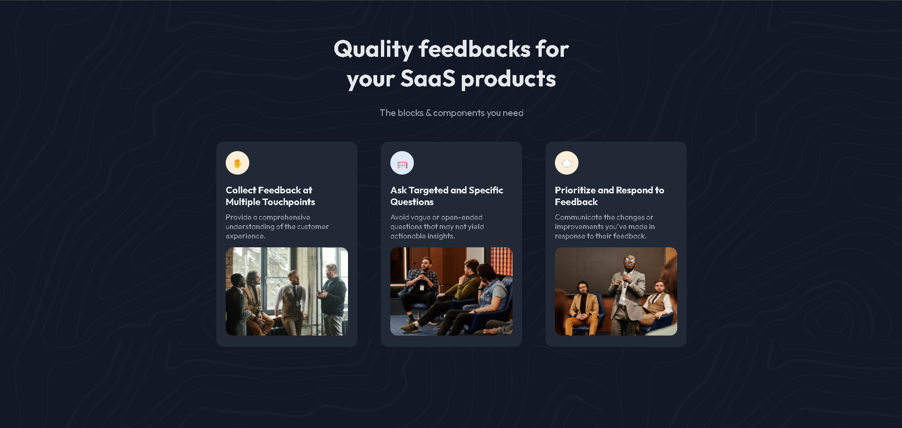

<h1 align="center">Devchallanges-Simple-Feature-Section</h1>

  Projeto da <a href="https://devchallenges.io/solution/35067">https://devchallenges.io/</a>.

 

  

## 🚀 Tecnologias

Esse projeto foi desenvolvido com as seguintes tecnologias:

- HTML e CSS(Não foi necessário responsividade. flex-wrap: wrap já foi o suficiente.)

## 💻 Projeto

Projeto para entrar nos conceitos de Front-End e desenvolvimento web.